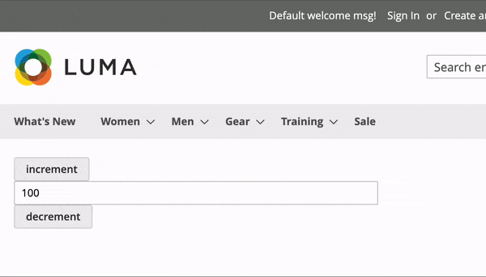
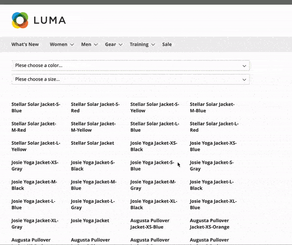

# Magewire Example Module

This is a Magento 2 module provides a couple of examples to start a journey with Magewire.

### 1. Installation:
* `composer config repositories.SnowdogApps/magewire-examples git git@github.com:SnowdogApps/magewire-examples.git`
* `composer require snowdog/magewire-example`
* `bin/magento setup:upgrade`

### 2. Run the examples:
After installation got to `<MAGENTO_HOST>/magewire` to run the two examples provided:

**Counter** `<MAGENTO_HOST>/magewire/counter`

This is the most simple example which Maguire's team suggests from various tutorial. 
Pressing the Increment / Decrement button makes the value of the field changing accordingly.

**Product Listing** `<MAGENTO_HOST>/magewire/productfilter/`

This example makes filers a collection of products by two filters without refreshing the page.

